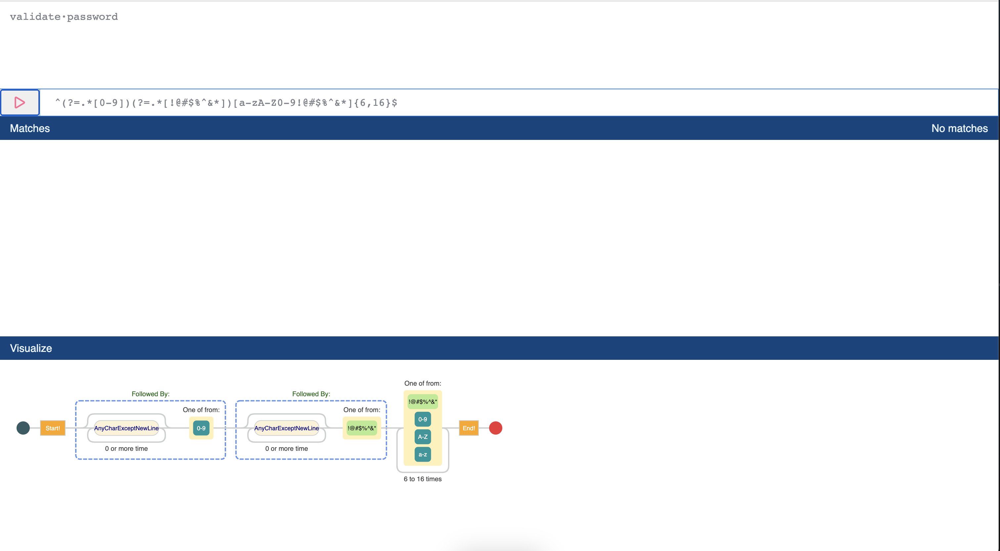

# RegExp generator

This website, powered by ChatGPT, is specifically designed to generate regular expressions, which are powerful tools for pattern matching and text manipulation.

## Table of Contents

<!-- TOC -->
* [RegExp generator](#regexp-generator)
  * [Table of Contents](#table-of-contents)
  * [Overview](#overview)
  * [Usage](#usage)
  * [Requirements](#requirements)
  * [Installation](#installation)
  * [Author Information](#author-information)
<!-- TOC -->

## Overview



## Usage
```
docker run -e OPENAI_API_KEY='<yourtoken>' -i -t --platform linux/amd64 -p 3000:3000 tkudlicka/regexp-chatgpt
```
After access website on http://localhost:3000/


## Requirements

* Nodejs `16.x` or newer.
* OpenAI API token

## Installation
Crete .env file in the root of your project:
```
OPENAI_API_KEY=<yourtoken>
```
And install dependencies
```
npm install && npm dev
```
## Author Information

This module is maintained by the contributors listed on [GitHub](https://github.com/tkudlicka/regexp-chatgpt/graphs/contributors).

## TBD
- [ ] Highlighting regexp input
- [ ] Highlighting matches
- [ ] Setup github actions
